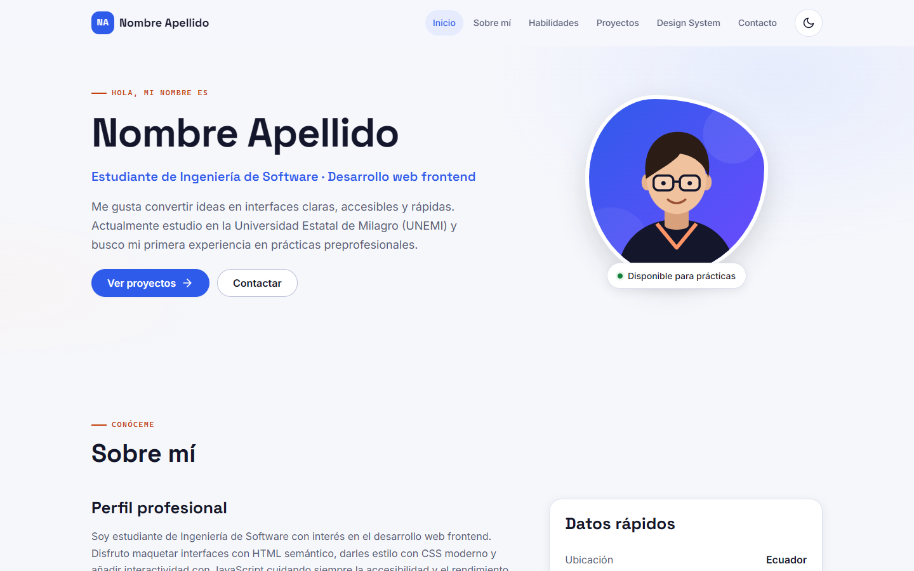
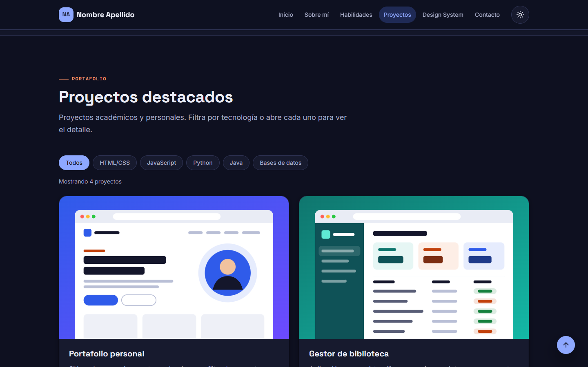
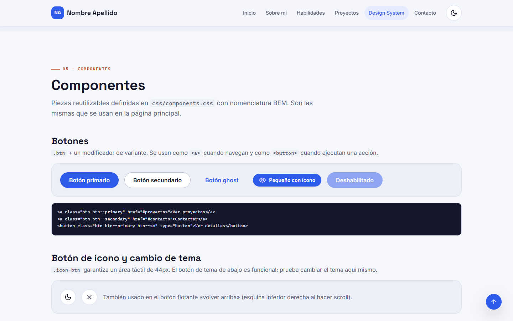

# Portafolio personal — Nombre Apellido

Portafolio web individual desarrollado con **HTML5 semántico, CSS propio y JavaScript puro** (sin frameworks). Presenta mi perfil profesional, habilidades, proyectos destacados y un **Design System** que documenta los tokens visuales y los componentes reutilizables del sitio.

- **Sitio publicado:** https://tu-usuario.github.io/
- **Repositorio:** https://github.com/tu-usuario/tu-usuario.github.io



## Capturas

| Tema oscuro (proyectos) | Móvil | Design System |
| --- | --- | --- |
|  |  |  |

## Secciones

| Sección | Contenido |
| --- | --- |
| **Inicio** | Nombre, perfil, breve presentación, avatar y llamadas a la acción. |
| **Sobre mí** | Perfil profesional, intereses, datos rápidos y formación académica. |
| **Habilidades** | Tecnologías por categoría (Frontend, Backend, Bases de datos, Herramientas y diseño) con ícono, descripción y nivel justificado. |
| **Proyectos** | 4 proyectos en cards reutilizables: descripción, problema que resuelve, tecnologías, imagen y enlaces al repositorio y a la demo. |
| **Design System** | Página propia (`design-system.html`) con colores, tipografía, espaciado, radios, sombras y componentes. |
| **Contacto** | Formulario validado y enlaces profesionales (correo, GitHub, LinkedIn). |

## Tecnologías

- **HTML5 semántico:** `header`, `nav`, `main`, `section`, `article`, `aside`, `figure`, `figcaption`, `address`, `dialog`, `footer`.
- **CSS3:** Custom Properties (design tokens), Flexbox, CSS Grid, media queries, `clamp()`, `color-mix()`, nomenclatura BEM.
- **JavaScript (ES6+):** sin librerías, organizado por responsabilidad.
- **Git + GitHub Pages** para control de versiones y publicación.
- Recursos externos: fuentes [Inter y Space Grotesk](https://fonts.google.com/) (Google Fonts) e íconos de tecnologías de [Devicon](https://devicon.dev/) (licencia MIT, copiados localmente).

## Funcionalidades interactivas

1. **Menú responsive:** botón hamburguesa con `aria-expanded`; se cierra con `Escape`, al hacer clic fuera o al elegir un enlace.
2. **Tema claro / oscuro:** respeta la preferencia del sistema y guarda la elección del usuario en `localStorage`.
3. **Filtro de proyectos por tecnología:** chips con `aria-pressed` y mensaje de estado para lectores de pantalla.
4. **Modal de detalle de proyectos:** usa `<dialog>` nativo; toma los datos de la propia card para no duplicar información.
5. **Validación del formulario:** mensajes por campo enlazados con `aria-describedby`, contador de caracteres y envío mediante el cliente de correo (`mailto`).
6. **Navegación dinámica:** resalta en el menú la sección visible (`IntersectionObserver`).
7. **Botón «volver arriba»** y **animaciones de aparición** que respetan `prefers-reduced-motion`.
8. **Design System vivo:** los valores de color se leen de las variables CSS según el tema activo y se pueden copiar con un clic.

## Design System

Todas las decisiones visuales están en [`css/tokens.css`](css/tokens.css) y los componentes solo consumen esas variables:

| Grupo | Tokens |
| --- | --- |
| Colores | `--color-primary`, `--color-secondary`, `--color-background`, `--color-surface`, `--color-text`, `--color-text-muted`, estados de éxito y error… |
| Tipografía | `--font-heading`, `--font-body`, `--font-mono`, escala `--fs-xs` a `--fs-3xl`, pesos y alturas de línea |
| Espaciado | Escala de 4px: `--space-3xs` (2px) a `--space-4xl` (96px) |
| Bordes y radios | `--border`, `--radius-sm`, `--radius-md`, `--radius-lg`, `--radius-full` |
| Sombras | `--shadow-sm`, `--shadow-card`, `--shadow-lg`, `--focus-ring` |
| Tamaños | `--container-max`, `--header-height`, `--touch-target`, `--icon-size`… |

El tema oscuro solo redefine los tokens de color bajo `:root[data-theme="dark"]`; ningún componente tiene estilos duplicados por tema.

## Estructura del proyecto

```text
.
├── index.html              # Página principal (inicio, sobre mí, habilidades, proyectos, contacto)
├── design-system.html      # Documentación del Design System / Componentes
├── css/
│   ├── tokens.css          # Design tokens (CSS Custom Properties) y tema oscuro
│   ├── base.css            # Reset, tipografía global y utilidades
│   ├── layout.css          # Contenedor, header, secciones y grillas responsive
│   ├── components.css      # Componentes reutilizables (BEM)
│   └── design-system.css   # Estilos exclusivos de la página del Design System
├── js/
│   ├── theme.js            # Tema claro/oscuro + localStorage
│   ├── main.js             # Menú, navegación activa, volver arriba, animaciones
│   ├── projects.js         # Filtro y modal de proyectos
│   ├── form.js             # Validación del formulario de contacto
│   └── design-system.js    # Valores de color en vivo y copia al portapapeles
├── assets/
│   ├── icons/              # Favicon e íconos de tecnologías (SVG)
│   └── img/                # Avatar e imágenes de proyectos (SVG)
└── docs/capturas/          # Capturas usadas en este README
```

## Cómo visualizarlo

**Opción 1 — abrir directamente:** descarga o clona el repositorio y abre `index.html` en el navegador.

**Opción 2 — servidor local (recomendado):**

```bash
git clone https://github.com/tu-usuario/tu-usuario.github.io.git
cd tu-usuario.github.io

# Con Python
python -m http.server 8000
# luego abre http://localhost:8000

# O con la extensión "Live Server" de VS Code: clic derecho en index.html → "Open with Live Server"
```

## Publicación en GitHub Pages

1. Sube el proyecto a un repositorio **público** en GitHub.
2. En el repositorio: **Settings → Pages**.
3. En **Build and deployment**, elige **Deploy from a branch**, rama `main` y carpeta `/ (root)`.
4. Espera un par de minutos y abre la URL que muestra GitHub.

## Buenas prácticas aplicadas

- Un solo `h1` por página y jerarquía de encabezados sin saltos.
- Enlaces para navegar y botones para ejecutar acciones.
- Imágenes con `alt` descriptivo y dimensiones (`width`/`height`) para evitar saltos de diseño.
- Formularios con `label` asociado a cada control y errores anunciados a lectores de pantalla.
- Enlace «Saltar al contenido», foco visible y áreas táctiles de al menos 44px.
- Mejora progresiva: sin JavaScript el contenido y la navegación siguen funcionando.
- HTML validado con [html-validate](https://html-validate.org/) sin errores.

## Autor

**Nombre Apellido** — Estudiante de Ingeniería de Software, Universidad Estatal de Milagro (UNEMI).

- GitHub: [@tu-usuario](https://github.com/tu-usuario)
- LinkedIn: [linkedin.com/in/tu-usuario](https://www.linkedin.com/in/tu-usuario)
